  

---

## 👥 Team

| | Name | Role | GitHub |
|---|---|---|---|
|  | Mohammad Al-Soleiman | Full Stack Engineer | [@Mohammadsoleiman](https://github.com/Mohammadsoleiman) |
|  | Mohammad Al-Hassan | Full Stack Engineer | [@mhmdalhassan](https://github.com/mhmdalhassan) |
|  | Hassan Awad | Full Stack Engineer | [@Hassan222-pixel](https://github.com/Hassan222-pixel) |

---

## ⚙️ How We Work

- **Performance first** — speed & reliability are non-negotiable
- **Clean code** — maintainable, readable, and reviewed
- **Ship it right** — done means tested & deployed

---

built with precision &nbsp;•&nbsp; © Hash Labs

&nbsp;

